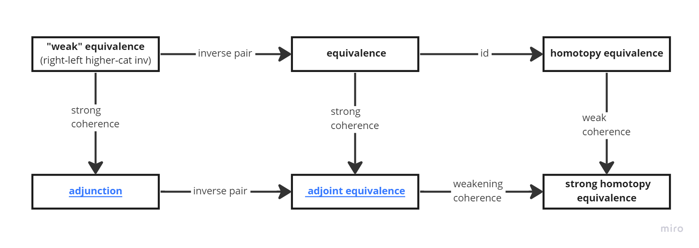

### План

1. Определение "слабых" эквивалентностей
	1. Определение [**"слабой" эквивалентности**](Определения/Слабая%20эквивалентность.md)
	2. Определение [**"когерентности"**](Определения/Когерентность.md)
	3. Определение [**сопряжения**](Определения/Сопряжение.md) -- как [**"слабую" эквивалентность**](Определения/Слабая%20эквивалентность.md), оснащённую [**"когерентностью"**](Определения/Когерентность.md)
2. Определение ("стандартных") эквивалентностей
	1. Определение [**эквивалентности**](Определения/Эквивалентность.md) -- как [**"слабую" эквивалентность**](Определения/Слабая%20эквивалентность.md), пара морфизмов которой образует "дуальную" пару
	2. Определение [**сильной эквивалентности**](Определения/Сильная%20эквивалентность.md) -- как [**сопряжение**](Определения/Сопряжение.md),  пара морфизмов которой образует "дуальную" пару
3. Определение гомотопических эквивалентностей
	1. Определение [**гомотопической эквивалентности**](Определения/Гомотопическая%20эквивалентность.md) -- как [**"слабую" эквивалентность**](Определения/Слабая%20эквивалентность.md)
	2. Определение [**сильной гомотопической эквивалентности**](Определения/Сильная%20гомотопическая%20эквивалентность.md) как обобщение [**сильной эквивалентности**](Определения/Сильная%20эквивалентность.md)

### Схема отношений

